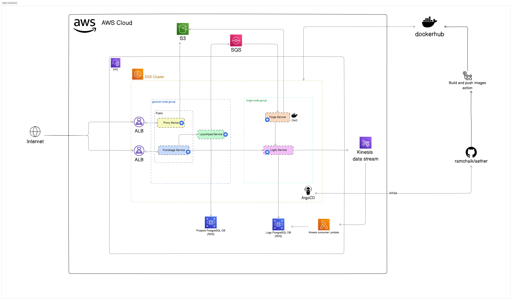

# Aether 🚀

Aether is a minimalist PaaS (Platform as a Service) offering, inspired by Vercel and Netlify. It allows you to deploy your npm projects effortlessly by simply providing a public repository URL.

## Demo 🎥


## Features ✨

- Easy deployment from public Git repositories
- Automatic builds and deployments
- Real-time log streaming
- Serverless architecture
- Microservices-based design
- Efficient inter-service communication using gRPC
- Intelligent auto-scaling with HPA and KEDA
- Comprehensive monitoring with Prometheus and Grafana

## Tech Stack 🛠️

- **Frontend**: NextJS 14, TypeScript, NextUI, Clerk (auth), Tailwind CSS, Zustand, React Query, Framer Motion
- **Backend**: Node.js, Go, Fastify, Chi
- **Database**: PostgreSQL
- **ORM**: Drizzle
- **Message Queue**: AWS SQS
- **Streaming**: AWS Kinesis
- **Storage**: AWS S3
- **Container Orchestration**: Kubernetes (AWS EKS)
- **CI/CD**: GitHub Actions, ArgoCD
- **Infrastructure as Code**: Terraform
- **Cloud Provider**: AWS
- **Inter-service Communication**: gRPC, Protocol Buffers
- **Auto-scaling**: Horizontal Pod Autoscaler (HPA), KEDA
- **Monitoring**: Prometheus, Grafana

## Microservices 🌐

1. **Frontstage**: Public-facing NextJS app for the user interface
2. **Launchpad**: Fastify app for project CRUD operations, uses gRPC for communication with other services
3. **Forge**: Go app for building and deploying projects, uses gRPC for communication with other services
4. **Logify**: Go app for log streaming and aggregation, uses gRPC for communication with other services
5. **Proxy**: Go app serving as a reverse proxy for deployed projects

## Architecture Diagram



## Project Structure 📁

```
├── src
│   ├── frontstage
│   ├── launchpad
│   ├── forge
│   ├── logify
│   └── proxy
├── tf
├── k8s
├── scripts
└── protobuf
```

<!-- ## Getting Started 🏁


TODO: add instruction here -->

## Deployment 🚢

Aether uses GitHub Actions for CI/CD, building and pushing Docker images to DockerHub. ArgoCD is used for GitOps, linking the GitHub repository to the EKS cluster.

## Infrastructure 🏗️

All infrastructure is provisioned using Terraform. Configuration files can be found in the `tf` folder.

## Kubernetes 🎡

Kubernetes manifests for deploying to AWS EKS are located in the `k8s` folder.

## Inter-service Communication 🔀

Aether utilizes gRPC with Protocol Buffers for efficient and type-safe communication between microservices. This ensures high performance and maintainability across the system.

## Auto-scaling ⚖️

Aether implements intelligent auto-scaling to ensure optimal resource utilization and responsiveness:

- **Horizontal Pod Autoscaler (HPA)**: Most pods use CPU metrics for scaling, ensuring efficient resource usage across the cluster.
- **KEDA (Kubernetes Event-driven Autoscaling)**: The Forge service utilizes KEDA with AWS SQS triggers, allowing it to scale based on the number of messages in the queue. This ensures rapid processing of build requests during high-demand periods.

This combination of HPA and KEDA allows Aether to dynamically adjust to varying workloads, maintaining performance while optimizing resource consumption.

## Monitoring 🔍
Aether uses Prometheus for collecting and storing metrics, and Grafana for visualizing and analyzing the collected metrics.


## Contributing 🤝

Contributions are welcome! Please feel free to submit a Pull Request.

## License 📄

This project is licensed under the [MIT License](LICENSE).
